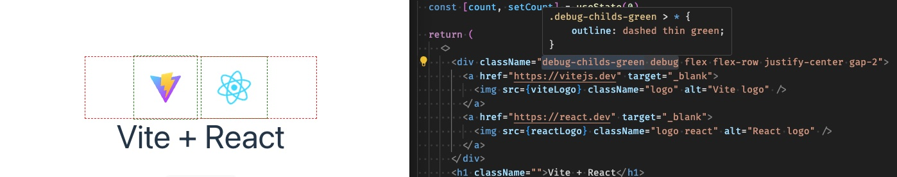

# Tailwind CSS ~ Debug Outline Plugin

A plugin that provides a `debug` component that makes colored outlines around **elements**, or **child elements** to view the structure.

## Example



Example using the utility classes `debug-childs-green` and `debug` in a `<div ...>` to display a (default) red outline of the div, and a green outline of the childs.

## Instalation

```
yarn add --dev tailwind-debug-outline
```

Then add the plugin to your `tailwind.config.js` file:

```js
import tailwindDebugOutline from 'tailwind-debug-outline'

/** @type {import('tailwindcss').Config} */
export default {
  plugins: [tailwindDebugOutline],
}

```

## Usage

Add one of the following classes to any element in your document.

* To outline the current element
  * `debug` - draw a _red_ dashed outline
  * `debug-green` - draw a _green_ dashed outline
  * `debug-blue` - draw a _blue_ dashed outline
  * `debug-yellow` - draw a _yellow_ dashed outline

* To outline the child elements
  * `debug-childs` - draw a _red_ dashed outline in every child element
  * `debug-childs-green` - draw a _green_ dashed outline in every child element
  * `debug-childs-blue` - draw a _blue_ dashed outline in every child element
  * `debug-childs-yellow` - draw a _yellow_ dashed outline in every child element

### Example HTML

```html
<div className="debug-childs-green debug flex flex-row justify-center gap-2">
    <a href="https://vitejs.dev" target="_blank">
        
    </a>
    <a href="https://react.dev" target="_blank">
        
    </a>
</div>
```